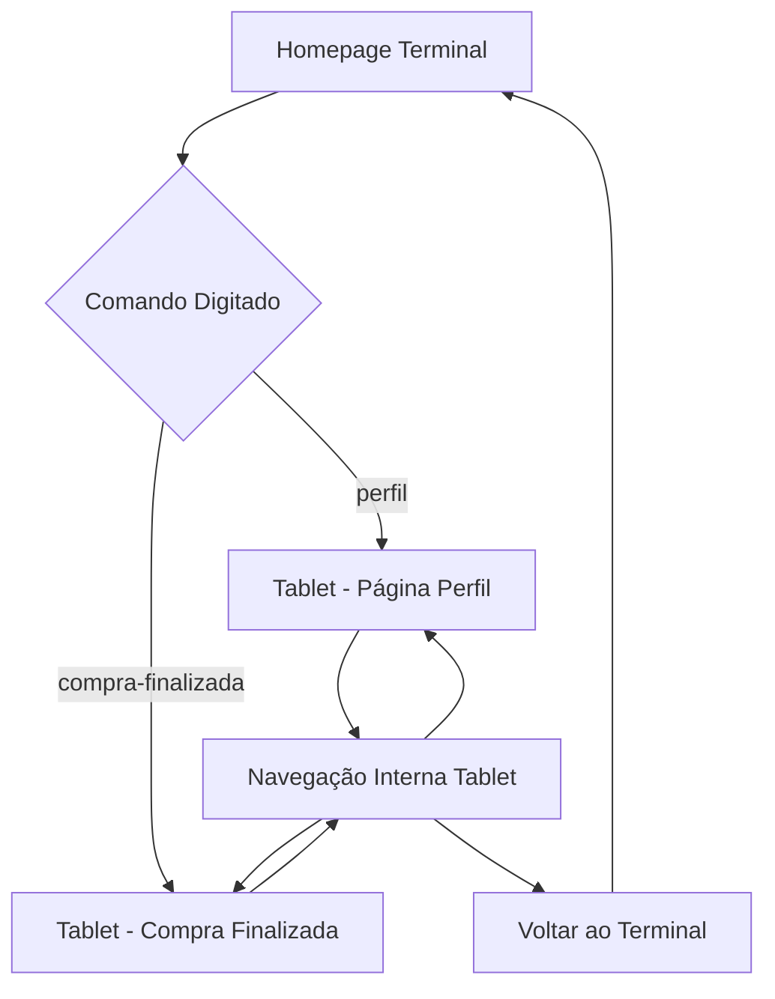

# 🚀 INDEX - Portfolio Inovador com Tablet Virtual

<div align="center">


</div>

## 📋 Descrição

**INDEX** é um projeto inovador que simula uma loja de eletrônicos com uma abordagem única de apresentação. O projeto combina uma **homepage temática de programação** com um **sistema de tablet virtual** para navegação interna, criando uma experiência de usuário diferenciada e moderna.

### 🎯 Conceito Principal

- **Homepage Temática**: Interface inspirada em terminal de programação com animação Matrix
- **Tablet Virtual**: Navegação interna simulando um dispositivo tablet real
- **Dual Layout**: Sistema responsivo que adapta entre desktop e tablet virtual

## ✨ Características Principais

### 🖥️ **Homepage (Terminal Programador)**
- **Tema Matrix**: Animação de caracteres caindo estilo "Matrix"
- **Interface Terminal**: Simulação de linha de comando interativa
- **Menu de Projetos**: Seleção de páginas através de comandos digitados
- **Font Personalizada**: Uso da fonte "Fira Code" para estética de programação
- **Animações Suaves**: Transições e efeitos visuais elegantes

### 📱 **Sistema Tablet Virtual**
- **Frame Realista**: Simulação visual de um tablet com bordas e proporções reais
- **Navegação Interna**: Sistema de navegação específico para o ambiente tablet
- **Navbar/Footer Integrados**: Interface completa dentro do tablet virtual
- **Responsividade**: Adaptação perfeita para diferentes tamanhos de tela

### 🎉 **Páginas Funcionais**
- **Perfil do Usuário**: Gerenciamento de perfil com upload de foto e alteração de senha
- **Compra Finalizada**: Página de confirmação com efeito de confetes animados
- **Layouts Duais**: Cada página funciona tanto no desktop quanto no tablet virtual

## 🛠️ Tecnologias Utilizadas

### **Frontend Framework**
- **Vue.js 3**: Framework principal com Composition API
- **Vue Router 4**: Gerenciamento de rotas e navegação
- **Vite**: Build tool e servidor de desenvolvimento

### **Styling & UI**
- **CSS3 Puro**: Estilização avançada sem dependências externas
- **Flexbox/Grid**: Layout responsivo moderno
- **Animations**: Animações CSS customizadas
- **Font Awesome**: Ícones profissionais

### **Recursos Especiais**
- **Canvas Animations**: Animação Matrix em JavaScript puro
- **File Upload**: Sistema de upload de imagens
- **Confetti Effect**: Animação de confetes em CSS/JS
- **Responsive Design**: Adaptação total para múltiplos dispositivos

## 🤝 Colaboradores

Agradecemos às seguintes pessoas que contribuíram para este projeto:

<table>
  <tr>
    <td align="center">
      <a href="#" title="defina o título do link">
        <br>
        <sub>
          <b>Jimmy Castilho</b>
        </sub>
      </a>
    </td>
    <td align="center">
      <a href="#" title="defina o título do link">
        <br>
        <sub>
          <b>Lívia Clemente</b>
        </sub>
      </a>
    </td>
    <td align="center">
      <a href="#" title="defina o título do link">
        <br>
        <sub>
          <b>Ana Clara</b>
        </sub>
      </a>
    </td>
        <td align="center">
      <a href="#" title="defina o título do link">
        <br>
        <sub>
          <b>Pedro Rodrigues</b>
        </sub>
      </a>
    </td>
  </tr>
</table>

## 📁 Estrutura do Projeto

```
IndexProjectTest/
├── index-vue-projeto/          # 🎯 Projeto principal Vue.js
│   ├── public/                 # Arquivos estáticos
│   │   ├── media/             # Imagens e recursos
│   │   └── vite.svg           # Logo do Vite
│   ├── src/                   # Código fonte
│   │   ├── components/        # Componentes Vue
│   │   │   ├── FooterComponent.vue
│   │   │   ├── NavBar.vue
│   │   │   ├── TabletFrame.vue     # 📱 Componente do tablet virtual
│   │   │   └── ThemeToggle.vue
│   │   ├── router/            # Configuração de rotas
│   │   │   └── index.js
│   │   ├── views/             # Páginas da aplicação
│   │   │   ├── HomeView.vue        # 🖥️ Homepage temática
│   │   │   ├── PerfilView.vue      # 👤 Página de perfil
│   │   │   └── CompraFinalizadaView.vue  # ✅ Confirmação de compra
│   │   ├── App.vue            # Componente raiz
│   │   ├── main.js            # Ponto de entrada
│   │   └── style.css          # Estilos globais
│   ├── package.json           # Dependências do projeto
│   ├── vite.config.js         # Configuração do Vite
│   └── index.html             # Template HTML
├── components/                 # 📦 Componentes legados
├── LICENSE                     # Licença do projeto
├── package.json               # Configuração raiz
└── README.md                  # 📖 Documentação
```

## 🚀 Como Executar o Projeto

### **Pré-requisitos**
- Node.js (versão 16 ou superior)
- npm ou yarn
- Git

### **Instalação e Execução**

1. **Clone o repositório:**
```bash
git clone https://github.com/jimmyadmsenior/IndexProjectTest.git
cd IndexProjectTest
```

2. **Navegue para o projeto Vue:**
```bash
cd index-vue-projeto
```

3. **Instale as dependências:**
```bash
npm install
```

4. **Execute o servidor de desenvolvimento:**
```bash
npm run dev
```

5. **Acesse no navegador:**
```
http://localhost:5173
```

### **Scripts Disponíveis**

```bash
npm run dev          # 🚀 Servidor de desenvolvimento
npm run build        # 📦 Build para produção
npm run preview      # 👀 Preview do build de produção
```

## 🎮 Como Usar

### **Homepage (Terminal)**
1. **Aguarde** a animação Matrix carregar
2. **Digite** comandos no terminal simulado:
   - `perfil` - Acessa a página de perfil no tablet
   - `compra-finalizada` - Vai para confirmação de compra
3. **Pressione Enter** para executar comandos

### **Navegação no Tablet**
- **Botão Perfil** (👤): Gerenciamento de usuário
- **Botão Compra** (✅): Página de confirmação
- **Voltar ao Terminal**: Botão disponível em todas as páginas

### **Página de Perfil**
- **Upload de Foto**: Clique na área da foto para selecionar imagem
- **Alterar Senha**: Use o formulário para mudança de senha
- **Navegação**: Use os botões do tablet para alternar páginas

## 🎨 Características Visuais

### **Paleta de Cores**
- **Primary**: `#111` (Preto terminal)
- **Secondary**: `#33aaff` (Azul tecnológico)
- **Accent**: `#00ff00` (Verde Matrix)
- **Success**: `#28a745` (Verde sucesso)
- **Gradient**: `#667eea` → `#764ba2` (Gradiente moderno)

### **Typography**
- **Primary Font**: "Fira Code" (Tema programação)
- **Fallback**: -apple-system, BlinkMacSystemFont, 'Segoe UI'
- **Icons**: Font Awesome 6

### **Animações**
- **Matrix Rain**: Caracteres caindo continuamente
- **Confetti Effect**: Confetes coloridos na confirmação
- **Smooth Transitions**: Transições suaves entre páginas
- **Hover Effects**: Feedback visual interativo

## 🔧 Personalização

### **Modificar Cores do Terminal**
```css
/* Em HomeView.vue */
.terminal-container {
  background: #000; /* Cor de fundo */
  color: #00ff00;   /* Cor do texto */
}
```

### **Ajustar Velocidade dos Confetes**
```javascript
// Em CompraFinalizadaView.vue
const randomDuration = 1.5 + Math.random() * 1; // Velocidade da queda
```

### **Customizar Animação Matrix**
```javascript
// Em HomeView.vue - método drawMatrix()
const fontSize = 14; // Tamanho dos caracteres
const columns = canvas.width / fontSize; // Densidade
```

## 🔄 Fluxo de Navegação



## 📱 Responsividade

- **Desktop**: Experiência completa com terminal e tablet virtual
- **Tablet**: Adaptação otimizada para telas médias
- **Mobile**: Layout responsivo com navegação simplificada
- **4K/Ultra-wide**: Suporte para telas de alta resolução

## 🤝 Contribuição

Contribuições são bem-vindas! Para contribuir:

1. **Fork** o projeto
2. **Crie** uma branch para sua feature (`git checkout -b feature/AmazingFeature`)
3. **Commit** suas mudanças (`git commit -m 'Add some AmazingFeature'`)
4. **Push** para a branch (`git push origin feature/AmazingFeature`)
5. **Abra** um Pull Request

## 📄 Licença

Este projeto está sob a licença MIT. Veja o arquivo [LICENSE](LICENSE) para mais detalhes.

## 👨‍💻 Autor

**Jimmy Castilho**
- GitHub: [@jimmyadmsenior](https://github.com/jimmyadmsenior)
- LinkedIn: [Jimmy Castilho](https://www.linkedin.com/in/jimmy-castilho-003733270/)

---

<div align="center">

**⭐ Se este projeto foi útil para você, considere dar uma estrela!**

**Feito com ❤️ e Vue.js**

</div>

